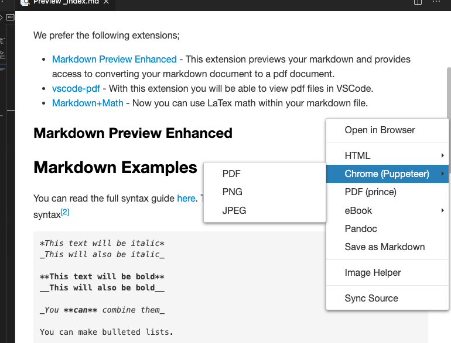

## Markdown

Markdown is a plain text formatting syntax aimed at making writing more accessible. The philosophy behind Markdown is that plain text documents should be readable without tags making a mess, but there should still be ways to add text modifiers like lists, bold, italics, etc. It is an alternative to WYSIWYG (what you see is what you get) editors, which use rich text that later gets converted to proper HTML.[^1]

## VSCode Markdown Extensions

We prefer the following extensions;

- [Markdown Preview Enhanced](https://marketplace.visualstudio.com/items?itemName=shd101wyy.markdown-preview-enhanced) - This extension previews your Markdown and provides access to converting your markdown document to a pdf document.
- [vscode-pdf](https://marketplace.visualstudio.com/items?itemName=tomoki1207.pdf) - With this extension you will be able to view pdf files in VSCode.
- [Markdown+Math](https://marketplace.visualstudio.com/items?itemName=goessner.mdmath) - Now, you can use LaTex math within your markdown file.

### Markdown Preview Enhanced

VSCode has its own Markdown previewer that displays the same icon in the top right corner of VSCode.  You will need to hover over each to see which is Markdown Preview Enhanced (MPE).  You will know that you are using MPE when your side view renders with a solid white background.  Once you can view your rendered document, you can convert it to a pdf (after saving your file) by right-clicking on the preview.  We recommend that you use `Chrome (Puppeteer) > PDF` to create a pdf document.



## Report Creating Process 



## Markdown Examples

You can read the full syntax guide [at the daringfireball.net website](https://daringfireball.net/projects/markdown/syntax). The code chunk below highlights the standard syntax[^2]

```Markdown
*This text will be italic*
_This will also be italic_

**This text will be bold**
__This will also be bold__

_You **can** combine them_

You can make bulleted lists.

* Item 1
* Item 2
  * Item 2a
  * Item 2b

Or numbered lists.

1. Item 1
1. Item 2
1. Item 3
   1. Item 3a
   1. Item 3b

Place an image in the document.


or a link in a document

[GitHub](http://github.com)

You can even blockquote Kanye West said:

> We're living the future so
> the present is our past.

Finally, you can create tables. Check out `print(df.to_markdown())` to get tables from pandas.

First Header | Second Header
------------ | -------------
Content from cell 1 | Content from cell 2
Content in the first column | Content in the second column


Every once in a while, you may want strikethrough.

~~this~~
```
### Getting tables out of Pandas

You can create tables using Markdown in your reports. You can use the `.to_markdown()` method on your `DataFrame` object. You would use `print(df.to_markdown(index=False))` to get tables from pandas. They would print out in your interactive window as;

```markdown
name  | gender
----- | ------
J.    | Male
Katie | Female
```

You would then copy the output from your interactive window and paste it into your `.md` report.
### Class template

We have built a [template](../../template/cse250_project_template_clean.md) to provide an example of you will submit your project reports. The template has three sections (for additional details please see the [instructional template](../../template/cse250_project_template.md)). As you use the template, the following items may help you understand how to write your report.

1. The template is a guide. Every line that does not have a hashtag (`#`) in front of it is guidance.  Don't feel responsible for including it.
2. The technical details section has the grand questions as subsections. You should include any work, explanation, charts, or tables that address under the grand question subsections. We have provided example descriptions before the grand question so you can see how to write in Markdown.
3. Your appendix should have properly highlighted Python code that doesn't run off the page (other than file paths).

[^1]: https://www.ultraedit.com/company/blog/community/what-is-markdown-why-use-it.html

[^2]: https://guides.github.com/features/mastering-markdown/
