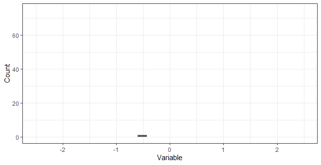
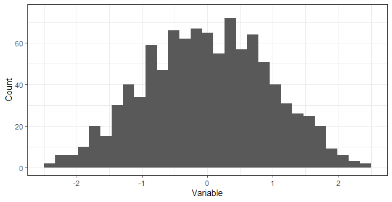

### No class today!

<!----------------------------------------------------
Day 1: A Classification Problem

## Welcome to class!

#### Announcements
#### Spiritual Thought

- [Don't wait for inspiration.](https://youtu.be/tr6mToyyjT0?t=1037)


<br>
------------------------------------------------------->
<!---------------------------------
## Spiritual Thought

What is the difference between these two charts?






> Elder Bednar, *Converted Unto the Lord*: "As the wise virgins emphasized properly, each of us must 'buy for ourselves.' These inspired women were not describing a business transaction; rather, they were emphasizing our individual responsibility to keep our lamp of testimony burning and to obtain an ample supply of the oil of conversion. This precious oil is acquired one drop at a time - 'line upon line [and] precept upon precept' (2 Nephi 28:30), patiently and persistently. No shortcut is available; no last-minute flurry of preparation is possible."

- What is your testimony built on?
- How do you receive answers from the Holy Ghost?
- How can you tell the difference between right and wrong?

<br>
---------------------------------->

## Machine Learning: Recognizing Patterns

<!-- https://www.microsoft.com/en-us/videoplayer/embed/RE4xAok?pid=RE4xAok-ax-85-id-oneplayer&postJsllMsg=true&autoplay=false&mute=false&loop=false&market=en-us&playFullScreen=false -->

<!---------------------------
<iframe width="560" height="315" src="https://www.youtube.com/embed/asmXyJaXBC8" frameborder="0" allow="accelerometer; autoplay; clipboard-write; encrypted-media; gyroscope; picture-in-picture" allowfullscreen></iframe>

<iframe width="560" height="315" src="https://www.youtube.com/embed/f_uwKZIAeM0" title="YouTube video player" frameborder="0" allow="accelerometer; autoplay; clipboard-write; encrypted-media; gyroscope; picture-in-picture" allowfullscreen></iframe>
---------------------->

<iframe width="560" height="315" src="https://www.youtube.com/embed/5q87K1WaoFI" title="YouTube video player" frameborder="0" allow="accelerometer; autoplay; clipboard-write; encrypted-media; gyroscope; picture-in-picture" allowfullscreen></iframe>

From [Sebastian Thrun](https://www.youtube.com/watch?v=ZJixNvx9BAc):
> AI is able to learn 'rules' from highly repetitive data.
>
> <br>
>
> The single most important thing for AI to accomplish in the next ten years is to free us from the burden of repetitive work. 

<br>

## Your Turn: Student Classification Problem

Can we predict if a student is from Utah?

<br>

## Your Turn: Features and Targets 

Import [dwellings.csv](https://byuistats.github.io/CSE250-Larson/projects/project-4/). With a neighbor:

1. **Try to describe the data.** Explain what each observation (row) is and what measurements we have on that observation (columns).
2. **Now try describing the modeling (machine learning) we are going to do in terms of "features" and "targets".** Watch out - are there any columns that are the target in disguise? (You may need to review the [project goal](../../projects/project-4).)
3. **What features do you expect to have a strong relationship with the target?**

<br>

## Before Next Class



[**Machine Learning Introduction**](https://byuistats.github.io/CSE250-Larson/course-materials/machine-learning/)

- Step-by-step guide (mostly) for training a GaussianNB classifier. (The steps will be the same for any algorithm you use.) 

[**Visual Introduction to Machine Learning**](http://www.r2d3.us/visual-intro-to-machine-learning-part-1/)

1. Machine learning identifies patterns using statistical learning and computers by unearthing boundaries in data sets. You can use it to make predictions.
2. One method for making predictions is called a decision trees, which uses a series of if-then statements to identify boundaries and define patterns in the data.
3. Overfitting happens when some boundaries are based on distinctions that don't make a difference. You can see if a model overfits by having test data flow through the model.






The goal of Grand Question 1 is to help us with "feature selection".

- Remember: Overfitting happens when some boundaries are based on on _distinctions that don't make a difference_.
- More data does not always lead to better models. ([Occam's Razor](https://www.google.com/search?q=Occam%E2%80%99s+Razor&rlz=1C1GCEJ_enUS882US882&oq=Occam%E2%80%99s+Razor&aqs=chrome..69i57&sourceid=chrome&ie=UTF-8))

Common questions:

- [Why it may be better to have fewer predictors in Machine Learning models?](https://www.kdnuggets.com/2017/04/must-know-fewer-predictors-machine-learning-models.html)
- [What is Feature Selection and why do we need it in Machine Learning?](https://blog.contactsunny.com/data-science/what-is-feature-selection-and-why-do-we-need-it-in-machine-learning)






[MaxRowsError: How can I plot Large Datasets?](https://altair-viz.github.io/user_guide/faq.html#maxrowserror-how-can-i-plot-large-datasets)

You may also save data to a local filesystem and reference the data by file path. Altair has a JSON data transformer that will do this transparently when enabled:

```python
alt.data_transformers.enable('json')
```





- [Home page](https://scikit-learn.org/stable/)
- [Tutorials](https://scikit-learn.org/stable/tutorial/index.html)
- [Getting Started](https://scikit-learn.org/stable/getting_started.html): _What do you notice about the header portion of each of the script chunks?_
  - [`import` vs `from ... import`](https://scikit-learn.org/stable/getting_started.html)



<!----------

#### [Bias-Variance Tradeoff](http://www.r2d3.us/visual-intro-to-machine-learning-part-2/)

> 1. Models approximate real-life situations using limited data.
> 2. In doing so, errors can arise due to assumptions that are overly simple (bias) or overly complex (variance).
> 3. Building models is about making sure there's a balance between the two.

#### But what is the 'Pavlovian bell' in the machine learning model?


Some mathematical penalty/reward equation.

> - __[Regression](https://setosa.io/ev/ordinary-least-squares-regression/)__
> - __[Variance, RMSE, SD](../../interactive/threshold_histogram.html)__
> - __proportions__


## Using our project data to understand features, targets, and samples.

> 1. Import `dwellings_ml.csv` and write a short sentence describing your data. Remember to explain an observation and what measurements we have on that observation.
> 2. Now try describing the modeling (machine learning) we are going to do in terms of features and targets.
>    A. Are there any columns that are the target in disguise?
>    B. _Are the observational units unique in every row?_


--------------->


<!------------------------
### If your model is near perfect in its predictability, you might be cheating.

### Watch out for [transactional data](http://localhost:1313/CSE250-Course/images/ml/iris_description.png)!

> - Financial: orders, invoices, payments
> - Work: plans, activity records
> - School: Grades
------------------------------->

<br>


