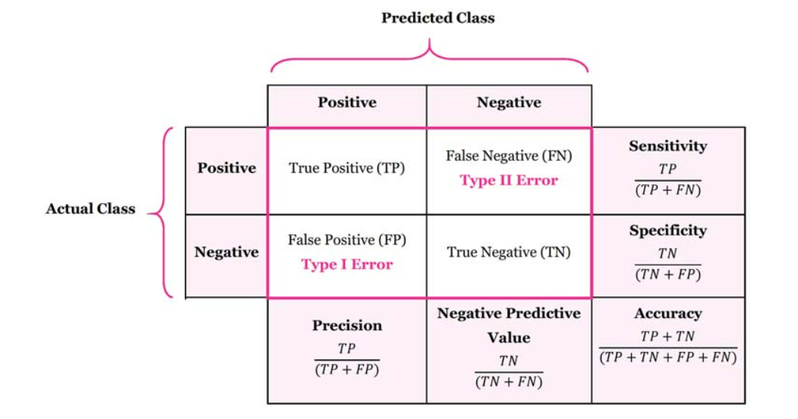

## Welcome to class!

#### Spiritual Thought

#### Announcements
1. Extra credit - Midterm feedback (I-Learn)
1. Coding Challenge code posted


<br>

## Building a Decision Tree

<iframe width="560" height="315" src="https://www.youtube.com/embed/ZVR2Way4nwQ" title="YouTube video player" frameborder="0" allow="accelerometer; autoplay; clipboard-write; encrypted-media; gyroscope; picture-in-picture" allowfullscreen></iframe>



```python
import pandas as pd
import altair as alt

from sklearn.model_selection import train_test_split
from sklearn.tree import DecisionTreeClassifier
from sklearn import metrics
```





```python
# %%
# Load data
dwellings_ml = pd.read_csv("https://github.com/byuidatascience/data4dwellings/raw/master/data-raw/dwellings_ml/dwellings_ml.csv")

#%%
# Separate the features (X) and targets (Y)
x = dwellings_ml.filter(["livearea","basement","stories","numbaths"])
y = dwellings_ml[["before1980"]]

#%% Split the data into train and test sets
x_train, x_test, y_train, y_test = train_test_split(x, y)
```




```python
#%%
# Create a decision tree
classifier_DT = DecisionTreeClassifier(max_depth = 4)

# Fit the decision tree
classifier_DT.fit(x_train, y_train)

# Test the decision tree (make predictions)
y_predicted_DT = classifier_DT.predict(x_test)

# Evaluate the decision tree
print("Accuracy:", metrics.accuracy_score(y_test, y_predicted_DT))
```



<br>

## Understanding Your Model

#### Visualizing decision trees

- From the readings: [A visual introduction to machine learning](http://www.r2d3.us/visual-intro-to-machine-learning-part-1/)
- [How to visualize a decision tree](https://mljar.com/blog/visualize-decision-tree/) in python

```python
#%%
from sklearn import tree
import matplotlib

#%% 
# method 1 - text
print(tree.export_text(classifier_DT))

#%% 
# method 2 - graph
tree.plot_tree(classifier_DT, feature_names=x.columns, filled=True)
```

<br>

#### Plotting feature importance

> Feature importance refers to techniques that assign a score to input features based on how useful they are at predicting a target variable. ([link](https://machinelearningmastery.com/calculate-feature-importance-with-python/#:~:text=Feature%20importance%20refers%20to%20techniques,at%20predicting%20a%20target%20variable.))

__What do we need from our model to create this plot?__


[ref](https://scikit-learn.org/dev/auto_examples/inspection/plot_permutation_importance.html)

```python
#%% 
# Feature importance
classifier_DT.feature_importances_

#%%
feature_df = pd.DataFrame({'features':x.columns, 'importance':classifier_DT.feature_importances_})
feature_df
```

<br>


## Evaluating model performance

##### Do your reading!

Read [How to evaluate your ML model](https://ranvir.xyz/blog/how-to-evaluate-your-machine-learning-model-like-a-pro-metrics/) and try googling other ideas.

- [The boy who cried wolf (the confusion matrix)](https://developers.google.com/machine-learning/crash-course/classification/true-false-positive-negative)
- [Accuracy](https://developers.google.com/machine-learning/crash-course/classification/accuracy)
- [Precision and Recall](https://developers.google.com/machine-learning/crash-course/classification/precision-and-recall)

- __[How to evaluate your ML model](https://ranvir.xyz/blog/how-to-evaluate-your-machine-learning-model-like-a-pro-metrics/)__
- __[Tour of Evaluation Metrics for Imbalanced Classification](https://machinelearningmastery.com/tour-of-evaluation-metrics-for-imbalanced-classification/)__


##### Accuracy

Problem 2 is looking for a model that has "at least 90% accuracy". 

##### Confusion Matrix




A confusion matrix is a quick way to see the strengths and weaknesses of your model. __A confusion matrix is not a "metric".__ A confusion matrix provides an easy way to calculate multiple metrics such as accuracy, precision, and recall.

**Your turn:** Look at the confusion matrix for our Decison Tree model. Where the model is doing well and where it might be falling short?

```python
#%%
# a confusion matrix
print(metrics.confusion_matrix(y_test, y_predicted_DT))

#%%
# this one might be easier to read
print(pd.crosstab(y_test.before1980, y_predicted_DT, rownames=['True'], colnames=['Predicted'], margins=True))

#%%
# visualize a confusion matrix
# requires 'matplotlib' to be installed
metrics.plot_confusion_matrix(classifier_DT, x_test, y_test)
```


